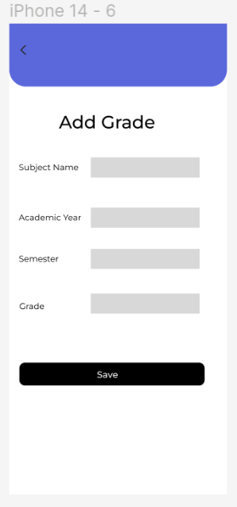
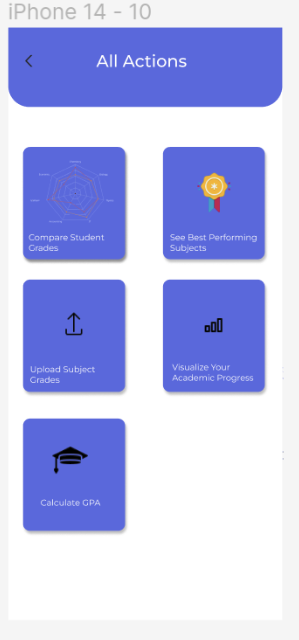
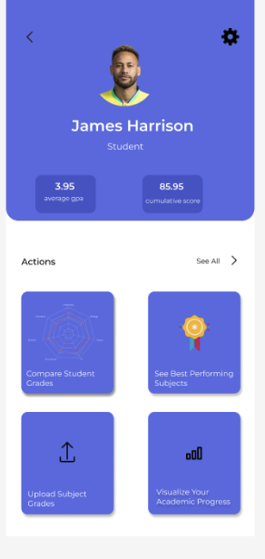
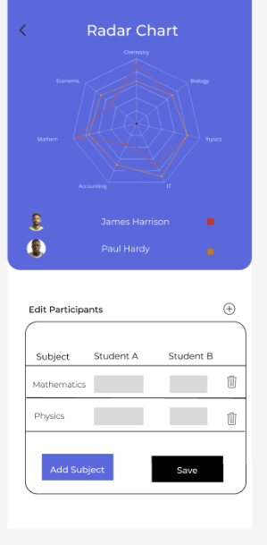
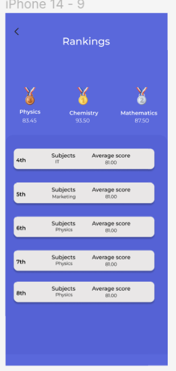

# Gradify Flutter

## Description
A Flutter Mobile Application which allows students to visualize their academic performances, add course grades, and pinpoint areas for improvements.

<br>

## Getting started
To run the mobile application, you need to clone the repository from Gitlab. You can do this by:

HTTPS
```
git clone https://github.com/TheRealKwabena/gradify-flutter/
```


## Requirements

- Maven
- Android Studio
- Flutter
- Dart


<br>

# Pages
## Upload Grade Page


## All Actions Page


## Home Page



## Compare Students Page



## Rankings
Cancelling already booked appointments is done from this page.


